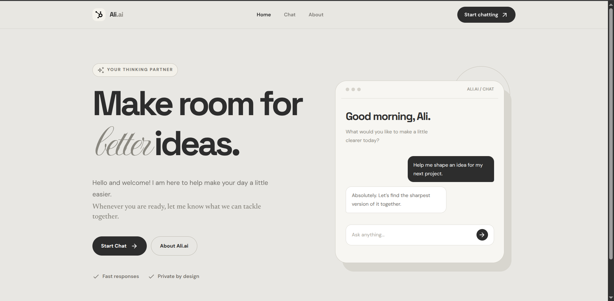
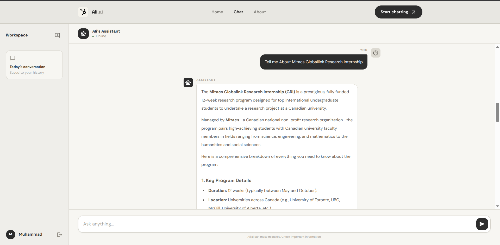
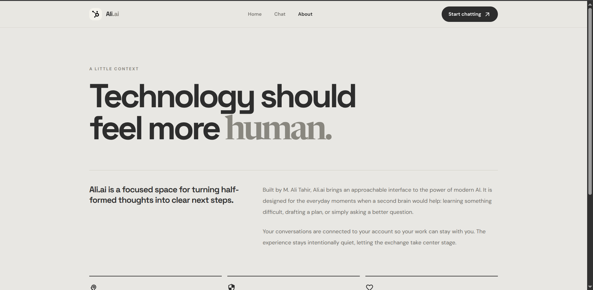

# Ali.ai

Ali.ai is a full-stack AI assistant built with React, Express, Google Gemini, and MongoDB. It provides a focused three-page experience for exploring the assistant, signing in, and keeping conversations organized.

## Features

- React Router pages for Home, Chat, About, and fallback navigation
- Responsive layout with a persistent Chat workspace
- Tailwind CSS v4 styling
- Material UI icons
- Login and account creation with form validation
- Password hashing with bcryptjs
- JWT-based authentication
- User and conversation persistence with MongoDB and Mongoose
- Chat history loaded per authenticated user
- Gemini-powered responses
- Daily Hero greetings cached in memory and browser storage
- GitHub-flavored Markdown with tables, task lists, blockquotes, links, and headings
- Syntax-highlighted fenced code blocks with copy-to-clipboard
- Toast notifications for auth, API, and session events
- Loading skeletons for chat history and animated response indicators
- Public SVG brand assets for the title and assistant mark

## Screenshots

### Home



### Chat



### About



## Technology

### Frontend

- React 19
- Vite
- React Router
- Tailwind CSS v4
- React Hook Form
- React Toastify
- React Markdown
- Remark GFM
- Rehype Highlight and Highlight.js
- Material UI icons

### Backend

- Node.js
- Express
- Mongoose
- MongoDB
- Google Gemini SDK
- bcryptjs
- JSON Web Tokens
- CORS
- dotenv

## Project Structure

```text
ChatBot-by-Ali/
├── Backend/
│   ├── models/
│   │   ├── Conversation.js
│   │   └── User.js
│   ├── .env.example
│   ├── package.json
│   └── server.js
├── Frontend/
│   └── chatbot/
│       ├── public/
│       │   ├── chatLogo.svg
│       │   └── title.svg
│       ├── src/
│       │   ├── components/
│       │   │   ├── Footer.jsx
│       │   │   ├── MarkdownMessage.jsx
│       │   │   └── Navbar.jsx
│       │   ├── pages/
│       │   │   ├── About.jsx
│       │   │   ├── Chat.jsx
│       │   │   └── Home.jsx
│       │   ├── routes/
│       │   │   └── AppRoutes.jsx
│       │   ├── App.jsx
│       │   ├── index.css
│       │   └── main.jsx
│       ├── index.html
│       ├── package.json
│       └── vite.config.js
├── docs/
│   ├── About.png
│   ├── chat.png
│   └── Home.png
├── docker-compose.yml
└── README.md
```

## Requirements

- Node.js 18 or newer
- npm
- Docker Desktop or Docker Engine with Compose
- A Google Gemini API key

## Setup

### 1. Install dependencies

```bash
cd Backend
npm install

cd ../Frontend/chatbot
npm install
```

### 2. Configure the backend

Create the environment file:

```bash
cd ../../Backend
cp .env.example .env
```

Set the values in `Backend/.env`:

```env
GEMINI_API_KEY=your_gemini_api_key
MONGODB_URI=mongodb://127.0.0.1:27017/ali-ai
JWT_SECRET=replace_with_a_long_random_secret
PORT=3000
```

Use a long random value for `JWT_SECRET`. Do not commit `.env` or expose API keys in source control.

### 3. Start MongoDB with Docker

From the repository root:

```bash
docker compose up -d mongodb
```

The Compose service publishes MongoDB on `127.0.0.1:27017` and stores data in the named volume `ali-ai-mongodb-data`.

Check the container:

```bash
docker compose ps
docker compose logs mongodb
```

Stop the service without removing its data:

```bash
docker compose stop mongodb
```

## Run Locally

Start the backend in one terminal:

```bash
cd Backend
npm start
```

The backend runs on `http://localhost:3000`.

Start Vite in another terminal:

```bash
cd Frontend/chatbot
npm run dev
```

The frontend normally runs on `http://localhost:5173`. If that port is busy, Vite selects another available port.

The Vite development server proxies `/api` requests to the backend.

## Production Build

Build the frontend:

```bash
cd Frontend/chatbot
npm run build
```

Start the backend:

```bash
cd Backend
npm start
```

The Express server serves the built frontend from `Frontend/chatbot/dist` and exposes the API from the same origin.

## Routes

| Route | Purpose |
| --- | --- |
| `/` | Home hero and product introduction |
| `/chat` | Authentication and persistent AI chat workspace |
| `/about` | Product and design context |
| Any unknown route | Redirects to Home |

## API Reference

### Authentication

#### `POST /api/auth/register`

Creates a user account.

```json
{
  "name": "Ali",
  "email": "ali@example.com",
  "password": "a-password-with-8-characters"
}
```

Returns a JWT and public user details.

#### `POST /api/auth/login`

Authenticates an existing user.

```json
{
  "email": "ali@example.com",
  "password": "a-password-with-8-characters"
}
```

#### `GET /api/auth/me`

Returns the authenticated user. Requires:

```text
Authorization: Bearer <token>
```

### Chat and history

#### `GET /api/history`

Returns the latest conversation for the authenticated user.

#### `POST /api/chat`

Generates a Gemini response and saves both the user message and assistant response.

```json
{
  "message": "Explain recursion with an example."
}
```

#### `GET /api/greetings`

Returns exactly two daily Hero greeting lines. The server caches the generated result for the current UTC day, and the frontend caches it in `localStorage` for the same date.

## Scripts

### Backend

| Command | Description |
| --- | --- |
| `npm start` | Start the Express server with Nodemon |

### Frontend

| Command | Description |
| --- | --- |
| `npm run dev` | Start the Vite development server |
| `npm run build` | Build the frontend for production |
| `npm run preview` | Preview the production build |
| `npm run lint` | Run ESLint |

## Troubleshooting

### MongoDB connection fails

Make sure Docker is running and start the database:

```bash
docker compose up -d mongodb
```

Confirm that port `27017` is available and that `MONGODB_URI` matches the running service.

### API requests fail from the frontend

Start the backend on port `3000`. During development, confirm that Vite is using the proxy configured in `Frontend/chatbot/vite.config.js`.

### Authentication does not persist

Check that `JWT_SECRET` is set and that MongoDB is available. The backend intentionally does not serve as a successful persistent application when the database connection fails.

### Port already in use

Vite can select another development port automatically. For the backend, set a different `PORT` value in `Backend/.env`.

## Security Notes

- Keep `Backend/.env` private.
- Rotate any API key that has been exposed publicly.
- Replace the development JWT fallback with a strong `JWT_SECRET` before deployment.
- Use HTTPS and secure cookie-based sessions for a production deployment.
- Add rate limiting and request validation before exposing the API publicly.

## Author

Built by [M. Ali Tahir](https://github.com/Ali1180-uni).
